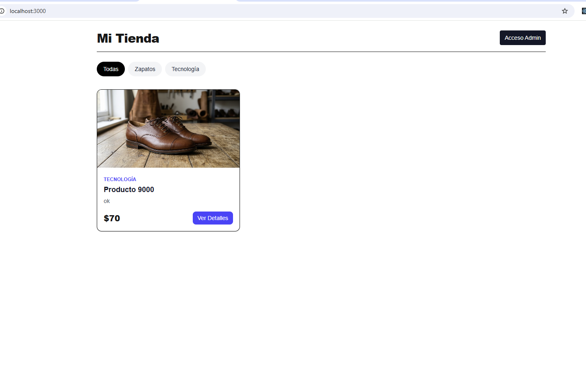

# 🛒 E-Commerce App (Next.js + MongoDB)

<p align="center">
  
</p>

Aplicación web de comercio electrónico desarrollada con **Next.js (App Router)**, **MongoDB** y **Tailwind CSS**. Incluye un panel de administración con sistema CRUD completo para la gestión de productos y categorías, subida de imágenes con limpieza automática en disco y vistas de detalle optimizadas con URLs amigables (slugs).

---

## 🚀 Características Principales

- **Vista Cliente (Front-end):**
  - Catálogo de productos con filtrado dinámico por categorías.
  - Rutas dinámicas basadas en **slugs** para ver el detalle de cada producto (`/products/[slug]`).
  - Diseño adaptable y responsivo con Tailwind CSS.

- **Panel de Administración (Back-end/CRUD):**
  - Gestión de categorías (creación en tiempo real).
  - CRUD completo de productos (crear, listar, editar y eliminar).
  - Subida de imágenes locales guardadas en `public/uploads`.
  - **Manejo inteligente de archivos:** Eliminación automática de la imagen previa en servidor al editar o eliminar un producto.

- **Arquitectura & Base de Datos:**
  - Modelado relacional con Mongoose (referencias entre Productos y Categorías).
  - Conexión optimizada a MongoDB (evita conexiones duplicadas en desarrollo).
  - Manejo asíncrono de rutas con los últimos estándares de Next.js App Router.

---

## 🛠️ Tecnologías Utilizadas

- **Framework:** [Next.js](https://nextjs.org/) (App Router, React 19 / Server & Client Components)
- **Base de Datos:** [MongoDB](https://www.mongodb.com/) con [Mongoose](https://mongoosejs.com/)
- **Estilos:** [Tailwind CSS](https://tailwindcss.com/)
- **Lenguaje:** TypeScript
- **Manejo de Archivos:** Node.js File System (`fs/promises`)

---

## ⚙️ Requisitos Previos

Asegúrate de tener instalado en tu equipo:

- **Node.js** (versión 18.x o superior)
- **npm** o **yarn**
- Una cuenta en **MongoDB Atlas** o una instancia local de MongoDB.

---

## 💻 Instalación y Configuración Local

Sigue estos pasos para ejecutar el proyecto en tu máquina local:

### 1. Clonar el repositorio

```bash
git clone [https://github.com/collectivecloudperu/tienda-nextjs-react-tailwind.git](https://github.com/collectivecloudperu/tienda-nextjs-react-tailwind.git)
cd tienda-nextjs-react-tailwind
```

### 2. Instalar dependencias

```bash
npm install
```

### 3. Configurar las Variables de Entorno

Crea un archivo `.env.local` en la raíz del proyecto y agrega tu cadena de conexión a MongoDB:

```env
MONGODB_URI=mongodb://localhost:27017/tienda_db
```

> **Nota:** Reemplaza `<usuario>` y `<password>` con tus credenciales de MongoDB Atlas.

### 4. Crear la carpeta para archivos subidos

Asegúrate de que la carpeta de almacenamiento para imágenes exista:

```bash
mkdir -p public/uploads
```

### 5. Iniciar el servidor de desarrollo

```bash
npm run dev
```

Abre [http://localhost:3000](http://localhost:3000) en tu navegador para ver la aplicación.

---

## 📌 Rutas de la Aplicación

| Ruta               | Descripción                                              |
| :----------------- | :------------------------------------------------------- |
| `/`                | Catálogo principal de productos con filtro por categoría |
| `/products/[slug]` | Página con la información detallada de un producto       |
| `/admin`           | Panel de administración (CRUD de productos y categorías) |

---

## 📝 Licencia

Este proyecto se distribuye bajo la licencia **MIT**. Consulta el archivo `LICENSE` para más información.
